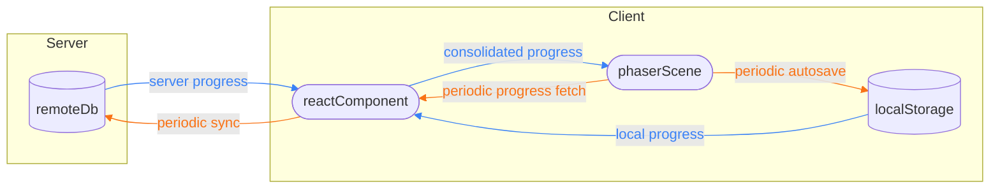

# Game state: registry vs. local save

Two separate key/value stores, easy to confuse. Quick reference for what's
in each.

Arrows are colored by whether data is flowing **into** `phaserScene` (blue)
or **out of** `phaserScene` (orange):



`reactComponent` (`PhasorGame.tsx`) reads local progress from `localStorage`
and fetches server progress from `remoteDb`, consolidates the two into one
starting point, and pipes it into `phaserScene` (`Game.ts`) via the Phaser
registry (below). From there, `phaserScene` autosaves to `localStorage` on its
own 1s timer; `reactComponent` separately polls `phaserScene` for progress
and sends it on to `remoteDb`.

## Phaser registry

Built-in Phaser API (`Phaser.Data.DataManager`) — `game.registry` /
`this.registry`, shared across the `Game` instance and every scene. In-memory
only, not persisted. It's how React hands data into a scene before that
scene's own fields exist.

Set in `src/phaser/main.ts` (`StartGame`), read in `src/phaser/scenes/Game.ts`
(`create()`):

| Key                  | Type                  | What                                    |
| --------------------- | ---------------------- | ------------------------------------------ |
| `seed`                 | `number`                | Today's deal seed                          |
| `initElapsedTimeMs`    | `number`                | Starting session clock value               |
| `initMoveArray`        | `CardMoveSequence[]`    | Starting move history, replayed onto the deck |

## Local save (`localStorage`)

Key: `freecellwithfriends_save`. Managed by `SaveController`
(`src/utils/save`); each module owns one chunk via its own `*Saveable.ts`.

```ts
{ data: { version }, state: { chunks: { meta, session, move } } }
```

| Key        | Type                    | Shape                                                          |
| ----------- | ------------------------- | ------------------------------------------------------------------ |
| `meta`       | `Meta`                     | `{ data: { version, seed }, state: { complete } }`               |
| `session`    | `Session`                  | `{ data: {}, state: { timeElapsedMs } }`                          |
| `move`       | `CardMoveSequence[]`       | `[{ steps, useTween }, ...]` — full move history, in order        |

Normally only `Game.ts` reads this (via `SaveController.loadFromStorage()`).
`PhasorGame.tsx` is the one exception — it reads the raw save directly via the
static `SaveController.getSave()`, before a scene exists, to decide what to
pass into the registry above.
